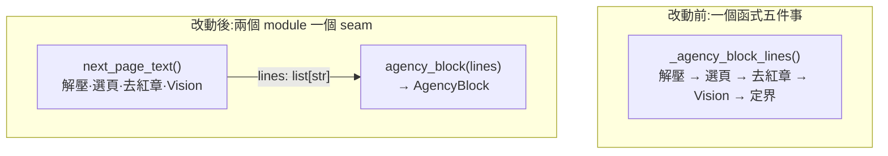
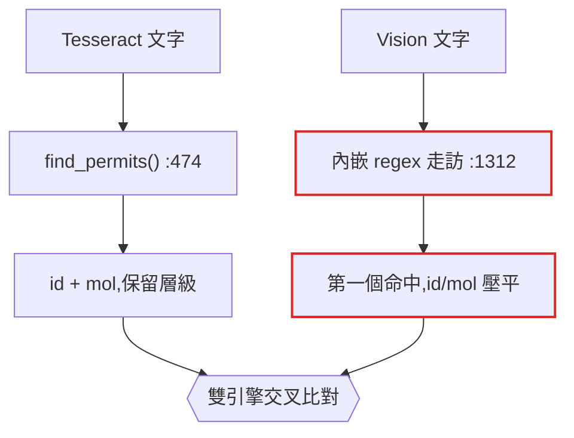
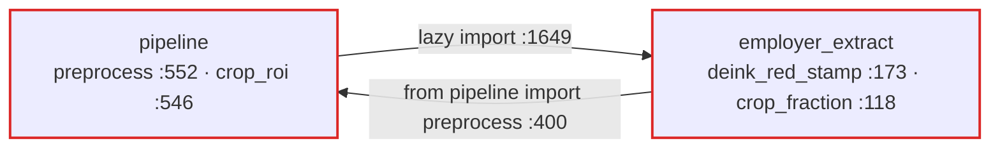

# 架構檢視 — 2026-07-28

檢視基準:`main` @ `76a1000`(2,195 + 620 + 469 + 262 行、147 測試)。
範圍鎖定近 40 個 commit 的熱區:`employer_extract` ×15、`pipeline` ×12、
`address_db` ×12、`permit_lookup` ×5。

領域用語照 [CONTEXT.md](../../CONTEXT.md)。架構用語固定使用:
**module／interface／implementation／depth／deep／shallow／seam／adapter／leverage／locality**
——不要換成 component、service、API、boundary、layer、wrapper。

> **deletion test**:設想把這個 module 刪掉。複雜度若消失,它本來就只是穿透層;
> 複雜度若在 N 個呼叫端重新長出來,它有在做事。

## 候選一覽

| # | 候選 | 強度 | 狀態 |
|---|---|---|---|
| 1 | [切開仲介反查台仲區塊的 seam](#1-切開仲介反查台仲區塊的-seam) | Strong | 未動 |
| 2 | [許可證文字只留一套判讀](#2-許可證文字只留一套判讀兩引擎共用) | Strong | 未動 |
| 3 | [台灣地址正規化只留一套](#3-台灣地址正規化只留一套) | Strong | ✅ 已完成 `78f5ee8` |
| 4 | [進 Sheets 的列只有一種形狀](#4-進-sheets-的列只有一種形狀) | Strong | 未動 |
| 5 | [獨立的影像前處理 module](#5-獨立的影像前處理-module循環消失) | Worth exploring | 未動 |
| 6 | [多數票純化,裁切圖交呼叫端](#6-多數票純化裁切圖交呼叫端寫出) | Worth exploring | 未動 |
| 7 | [已知清單管道通不過 deletion test](#7-已知清單管道通不過-deletion-test) | Strong | 未動 |

**建議動手順序**:1 →(2 或 7)。1 是熱區且最不可測;7 最便宜且是個決定而非重構。

---

## 1. 切開仲介反查台仲區塊的 seam

**強度** Strong ｜ **依賴類別** in-process

**檔案** `employer_extract.py:422–528`、`pipeline.py:1675–1791`

### 問題

`_agency_block_lines` 一個函式做五件事:

| 行 | 做的事 |
|---|---|
| :429 | docx 解壓 |
| :433 | 選頁 |
| :441 | 去紅章前處理 |
| :442 | **Vision 呼叫** |
| :445–458 | **台仲／印尼定界規則**(標籤錨點、放寬到乙方、`_ID_LINE` 排除) |

定界規則(:445–458)是全 repo 最常改的邏輯——近 8 個 commit 有 5 個在動它
(32324／32345 左右不定、32401 交錯版面)——但要碰到它必須付出一次 docx 解壓
加一次 Vision 呼叫。因此只有 `_is_agency_label_line` 這個述詞有測試,
**它所定界出來的區塊本身完全沒有測試**。

### 做法

在 :445 上方切一刀。一個 module 吃 OCR 行、吐台仲區塊;docx 與 Vision 那半段
變成它的薄呼叫端。



### 收穫

- locality:台印分離規則集中在一個 module
- the interface is the test surface:行進、區塊出
- leverage:一個 interface,後面四個抽取器(`_phones_in_block`／`_name_in_block`／
  `_address_in_block` 都已經是純 `list[str] → str`,seam 就差最後一刀)
- 32324／32345／32401 每一條教訓都變成回歸測試,不必再跑真實 docx

---

## 2. 許可證文字只留一套判讀(兩引擎共用)

**強度** Strong ｜ **依賴類別** in-process

**檔案** `pipeline.py:452–471`、`474–497`、`1312–1316`、`1363–1368`

### 問題

整個設計建立在「兩引擎一致才自動 key-in」,但兩邊的文字是被**兩套不同的實作**
判讀的:

- Tesseract 走 `find_permits()` (:474) — 保留 id／mol 之分與命中層級
- Vision 走 `run_google_vision()` 內嵌的 regex 走訪 (:1312–1316) —
  取兩個清單裡的第一個命中,**把 id 與 mol 的區別壓平了**

許可證的「形狀」還被編碼在兩處:`RE_PERMIT_ID_LIST` (:452) 與
`_RE_PERMIT_VALUE` (:1363)。改格式要動兩個地方。



### 做法

一個 module 把 OCR 文字讀成 permit reading,兩個引擎都呼叫它;
`_is_valid_permit_format` 一併收到同一個 interface 後面。

### 收穫

- 交叉比對比的是同類的東西
- leverage:一個 interface,兩個引擎
- 許可證格式改一處
- 現有 `find_permits` 的測試仍然有效

---

## 3. 台灣地址正規化只留一套

**強度** Strong ｜ **狀態** ✅ 已於 `78f5ee8` 完成

原問題:`address_db.fold_variants`(原私有 `_norm`)與 `permit_lookup._norm_addr`
各自實作一套「地址正規化」且行為不一致——後者不折疊 臺/台 也不折疊段號,
偏偏它才是反查救援比相似度用的那一套。

決議與實測依據見 [ADR-0001](../adr/0001-address-db-owns-tw-text-normalisation.md)
與 [ADR-0002](../adr/0002-addr-match-min-stays-0.72.md)。

**留給後續的教訓**:此候選在原始報告中被我標為「唯一會改變 pipeline 目前答錯結果的
候選」,**這是錯的**。乾淨輸入下命中率本來就 100%,折疊不修正任何既有錯誤答案;
它買的是 OCR 受損時的餘裕(20% 損壞多救 25/300 件、誤配 +1)。
排候選優先序時要分清「修正既有錯誤」與「擴大可救回範圍」。

---

## 4. 進 Sheets 的列只有一種形狀

**強度** Strong ｜ **依賴類別** in-process

**檔案** `pipeline.py:1675–1791`、`1808–1827`、`2075–2104`、`2143–2150`

### 問題

三種列的形狀匯進 `_row_to_sheet_values`:

| 來源 | 形狀 |
|---|---|
| `VisionQueueItem` (:198) | dataclass |
| manual_review dict (:1241) | `{"source_docx", "reason"}` + 事後被塞 `final_value` |
| vision outcome dict (:2075) | `{"source_docx", "candidate_value", "reason"}` |

後兩者**只差值放在哪個 key**,於是:

- `_row_to_sheet_values` :1815 要 `isinstance` 判型
- :1820 要寫 `r.get("final_value") or r.get("candidate_value", "")`
- `rescue_manual_review_via_agency_phone` 要一個 `value_key` 參數 (:1676)
  才知道自己拿到的是哪一種,而且**就地竄改**傳入的 list,`main` 再於 :2144–2150 讀回

### 做法

一種 `SheetRow`,在結果已知的地方就建好;救援**回傳**新的列而非竄改參數。

### 收穫

- 117 行的救援函式變得可測(回傳結果而非產生副作用)
- interface 縮小:`value_key` 參數消失
- 跨階段的就地竄改消失
- locality:欄位對應集中在一個 module

---

## 5. 獨立的影像前處理 module(循環消失)

**強度** Worth exploring ｜ **依賴類別** in-process

**檔案** `pipeline.py:546–574`、`employer_extract.py:118–126`、`173–203`、`396–405`

### 問題

`employer_extract` 反過來 import `pipeline`,形成真正的循環,靠函式內延遲 import
撐著(`employer_extract.py:400` 的註解自己寫著「延遲 import 避免循環」):



而且**去紅章有兩套實作**:`pipeline.preprocess` 與 `deink_red_stamp` 共用同一段
百分位對比拉伸,差別只在抹白遮罩;裁切也有兩套(`crop_roi` 吃 PIL Image、
`crop_fraction` 吃 bytes,分數運算一模一樣)。

### 做法

一個 leaf module 擁有裁切與去紅章,兩邊都依賴它,誰也不依賴誰。
`employer_extract.py:400` 的延遲 import 是**刪掉**而非搬家。

### 收穫

- 循環被刪除而非繞過
- 一套去紅章,兩個呼叫端
- `employer_extract` 可獨立 import
- 像素邏輯可單獨測試

---

## 6. 多數票純化,裁切圖交呼叫端寫出

**強度** Worth exploring ｜ **依賴類別** in-process

**檔案** `pipeline.py:601–629`、`632–704`、`707–852`

### 問題

`scan_image_large` 145 行,在六條程式路徑上把 `mkdir`／`save` 與 OCR、投票交織
(:742、:797、:803 等)。**沒有任何 seam 能在不碰硬碟的情況下跑投票邏輯**,
所以整段沒有測試。

重複:

- mol 多數票區塊在 `scan_image_mol_only` :643–663 與 `scan_image_large` :729–752
  是同樣 20 行,只差結尾 `return` 與 `continue`
- 「得票平均信心」同樣的算術寫了三次(:647、:733、:827)
- 裁切圖儲存 + 低信心圖儲存有四份

### 做法

一個 module 把 image bytes 變成 reading;裁切圖的寫出移到 `run_scan`
——它本來就擁有輸出目錄。

### 收穫

- 投票邏輯不碰硬碟即可測
- 刪掉複製貼上的 mol 區塊
- 得票平均信心只算一次
- ⚠ 本候選手術面最大,建議分階段做

---

## 7. 已知清單管道通不過 deletion test

**強度** Strong ｜ **依賴類別** in-process

**檔案** `pipeline.py:1394–1416`、`1547–1585`、`1873–1888`、`2065`、
`test_verify.py:561–599`

### 問題

`_append_upload_log` (:1575)、`_load_upload_log` (:1547)、`keyin_to_sheets` (:1873)
**全 repo 沒有任何呼叫點**(已在 `.py` 全檔驗證,含測試)。因此:

1. `upload_log.csv` **從來沒有被寫出過**
2. `load_known_permits_from_log` (:1394,於 :2065 被呼叫)**恆回傳空集合**
3. `verify_vision_result` 裡 `in_known_list` 的分支(:1451、:1471、:1486、:1508)
   在全新部署上**不可到達**
4. `test_verify.py::TestLoadKnownPermits` 有 4 個測試正對著一個
   **輸入永遠不存在**的讀取函式在綠燈

套 deletion test:刪掉它,複雜度不會在任何呼叫端重新長出來——它只是消失。
這就是答案,它現在這個樣子並沒有在做事。

### 做法(二選一,兩個都可以,但不要維持現狀)

- **A 接起來**:在 Sheets append 成功後呼叫 `_append_upload_log`。
  已知清單開始按 README 所述,替 D 欄 reason 補一句「此值歷史出現過」幫人工排序。
- **B 刪掉**:移除三個無呼叫者的函式、`in_known_list` 欄位與其四個測試。
  約 120 行與一個惰性概念離開 codebase。

維持現狀是唯一糟糕的選項——它讓四個綠燈測試指著已死的行為。

---

## 一併查證但不屬架構層的問題

**`conftest.py:14` 的 sys.path 是錯的**

```python
ROOT = Path(__file__).resolve().parent.parent
```

`conftest.py` 位於 repo 根目錄,所以這行插入的是 `C:\projects`——**repo 的上一層**,
而不是專案本身。`import pipeline` 目前能成立,靠的是 pytest 自己的 rootdir 插入在做
真正的工作。一旦改用 `--import-mode=importlib`,或有人把 conftest 移進 `tests/` 目錄,
就會無聲失效。

---

## 如何重跑這份檢視

```
/improve-codebase-architecture
```

會重新走一次熱區探索並輸出 HTML 報告到系統暫存區。本檔是 2026-07-28 那次的
markdown 存檔(HTML 在暫存區會被清掉,故納入版控供後續維護參考)。

重跑時記得:候選 3 已完成,且 `docs/adr/` 現在有兩份決策紀錄——
**檢視結果若與 ADR 衝突,要明確標示並說明為何值得重開,不要靜默推翻**。
